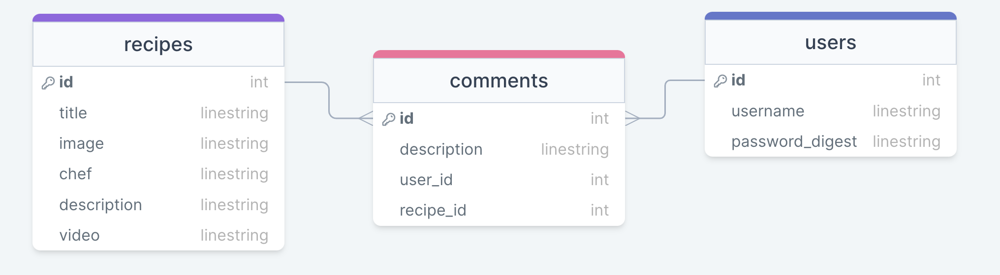
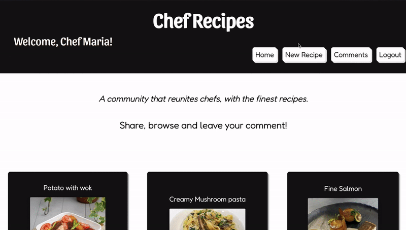
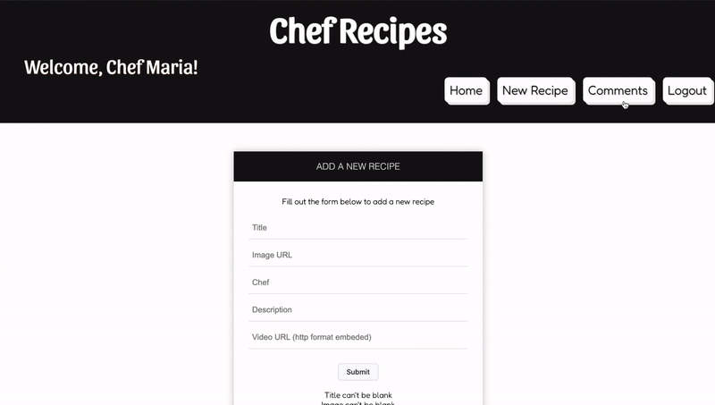

# Chef Recipes


<a href="https://www.buymeacoffee.com/brasildu" target="_blank"></a>

## Built with:
        

## Description
This application allows culinary chefs to join other chefs from all over the world. With the application, a chef is able to sign up and login in order to be a member of the community, sharing, leaving feedbacks and uploading new recipes.  

## Walk-through video:
https://www.youtube.com/watch?v=aH9A6q8cYCk  


## Getting Started
Follow the steps below to set up both front-end and back-end code.

### chef-recipes-project directory (back-end)

- Install gems from Gemfile for backend

 ```bash
bundle install
  ```

- Execute database table migrations and seeding

 ```bash
 rails db:migrate db:seed
  ```
  
- Run server

 ```bash
rails server
  ```

### chef-recipes-project/client/ directory (front-end)

- Install dependencies  

 ```bash
npm install
  ```
  
- Start development server
  
 ```bash
npm start
  ```


## Database Tables: recipes, comments and users



## Usage

In this application, a chef (user) is able to sign up and have its information saved for future login.

* ### Logging in
Once the application is loaded, a form will be displayed along with a brief description of the webpage. Users are able to create an account and login:


<br/>

* ### Interacting with the recipes
Once redirected to the home page, a user is able to browse a list of recipes from other chefs. Clicking on the play button of a recipe, loads a page with a video and information about the recipe:


<br/>

* ### Adding a recipe
In the Navbar, you can find the 'New Recipe' link to open a form so a user can submit recipes. The form is helpful on the way that it makes sure that all the input fields are validated before creating a new recipe:



<br/>

* ### Adding, editing and removing a comment
Also in the Navbar, the user is able to navigate to the Comments section. There, you can add, edit and remove a comment (editing and removing a comment should be only able to work if the comment belongs to the user that is logged in).



<br/>

## Support
For any questions related to the project's functionality, code, or usage, please reach out to:
brasildu@gmail.com


